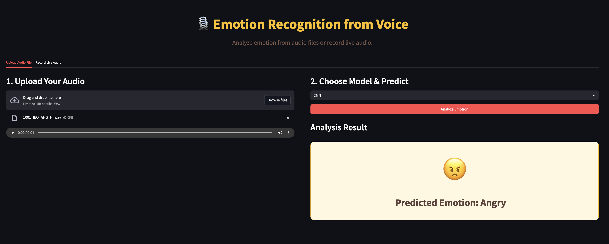
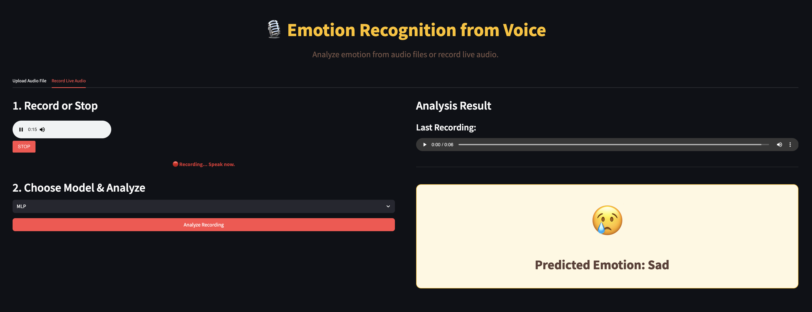

# EmotionRecognition 

Build a multiclass emotion‐recognition system that classifies six emotional states—anger, disgust, fear, happiness, neutral, and sadness—from short voice recordings by extracting audio features (e.g., MFCCs and mel-spectrograms) and training four separate models (SVM, KNN, MLP, and CNN) to compare their performance.

🤢 😄 😢 😠 😨 😐

## Project Structure

```
EmotionRecognition/
├── Data/                   # Raw audio files and CSV label files, CREMA-D
├── Utils/                  # Feature‐extraction and preprocessing helpers
├── Models/                 # Model definitions (e.g., cnn_model.py, svm_model.py, etc.)
├── Training/               # Training scripts for each model
├── Trained_Models/         # Saved model weights (.pth, .pkl)
├── Frontend/               # Streamlit app code
├── Test/                   # Unit and integration tests
├── requirements.txt        # Python dependencies
```

## Setup

```bash
1) Clone repo
git clone https://github.com/shuklashreyas/EmotionRecognition
cd EmotionRecognition

2) Create conda environment
conda create -n emotion-voice python=3.10 -y
conda activate emotion-voice

3) Install dependencies
pip install -r requirements.txt
pip install streamlit
pip install streamlit-webrtc
```

## Running the Program

```bash
streamlit run Frontend/app.py
```

Open your browser and navigate to: http://localhost:8501

## Frontend View & Usage

### Upload Audio Feature


**Upload Audio tab** → Choose a WAV file & model → See the predicted emotion

### Record Audio Feature  


**Record Audio tab** → Click Start/Stop → Save & Predict → Review your recording + prediction

## Model Performance

Our emotion recognition system achieves the following accuracies on the test dataset:

| Model | Accuracy | Notes |
|-------|----------|-------|
| **CNN** | **98%** | Deep learning model using mel-spectrograms |
| **SVM** | **96%** | Support Vector Machine with feature scaling |
| **MLP** | **65%** | Multi-Layer Perceptron neural network |
| **KNN** | **48%** | K-Nearest Neighbors classifier |

*Performance metrics are based on 6-class emotion classification (anger, disgust, fear, happiness, neutral, sadness) using the CREMA-D dataset.*

## How It Works

### Preprocessing:
- **Load WAV** → Extract 128×128 mel-spectrogram from audio signal
- Apply feature normalization and data augmentation techniques
- Convert audio to standardized format for consistent processing

### Prediction:
- **CNN**: Deep convolutional model trained directly on mel-spectrograms for pattern recognition
- **SVM/MLP/KNN**: Traditional ML approach:
  1. Flatten mel-spectrogram into feature vector
  2. Apply feature scaling for normalization
  3. Use PCA for dimensionality reduction
  4. Feed into classical machine learning model

The CNN approach leverages spatial patterns in spectrograms, while traditional ML models rely on statistical features extracted from the flattened audio representations.

## Training & Fine-tuning

If you want to retrain or fine-tune the models with your own data:

```bash
# Train CNN model
python Training/cnn_train.py

# Train SVM model
python Training/svm_train.py

# Train MLP model
python Training/mlp_train.py

# Train KNN model
python Training/knn_train.py
```

Each training script includes hyperparameter tuning, cross-validation, and model evaluation metrics.

## Libraries Used

- **Audio Processing**: librosa, soundfile, pyaudio
- **Machine Learning**: scikit-learn, tensorflow/keras, torch
- **Feature Extraction**: librosa (MFCC, mel-spectrograms), numpy
- **Web Interface**: streamlit, streamlit-webrtc
- **Data Handling**: pandas, numpy, matplotlib
- **Model Persistence**: pickle, joblib

## Dataset

This project uses the **CREMA-D** (Crowdsourced Emotional Multimodal Actors Dataset) containing:
- 7,442 audio clips from 91 actors
- 6 emotion categories: anger, disgust, fear, happiness, neutral, sadness
- Balanced dataset with demographic diversity
- [Please refer to orginal dataset extracted](https://github.com/CheyneyComputerScience/CREMA-D)

## Authors

- [Shreyas Shukla](https://github.com/shuklashreyas) - CNN, Code Modularity, Frontend
- [Pavithra Ponnolu](https://github.com/pponn) - SVM, Research
- [Kashvi Mehta](https://github.com/kashvime) - MLP, Dataset Extraction
- [Josh Len](https://github.com/Josh-Len) - KNN, Research

## Demo & Slides & Final Report

- [Video Demo](https://drive.google.com/file/d/1Bl0TcKuDguN_U-6x9Dm1zW89pRkIFui5/view?usp=sharing)
- [Google Slideshow Presentation](https://drive.google.com/file/d/1FuzVh6-ys5HXoX531fwhe3_gbTbmYSmK/view?usp=sharing)
- Final Report

## Future Work

- **Expand Dataset**: Collect noisy, accented, multi-device audio and diverse dialects for greater robustness.
- **Multi-Modal Fusion**: Integrate audio with video or physiological signals to enrich emotion cues.
- **On-Device Deployment**: Compress the model for low-latency, real-time inference on mobile/embedded devices.
  

## Acknowledgments

- CREMA-D dataset creators for providing high-quality emotional speech data
- Open-source community for the excellent libraries that made this project possible
- This project was made during Summer for CS4100 (AI) NEU